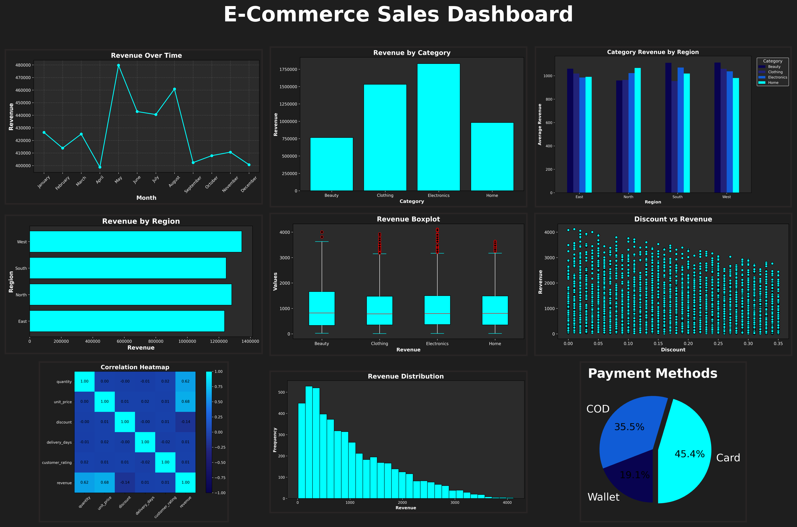

<p align="center">
  
</p>


# 📊 E-Commerce Sales Analysis using Matplotlib

A complete **Exploratory Data Analysis (EDA)** project built using **Python**, **Pandas**, and **Matplotlib**. This project explores an e-commerce sales dataset through a variety of visualizations, demonstrates important Matplotlib chart types, and concludes with a business-style dashboard summarizing the key insights.

---

## Overview

This project focuses on analyzing an e-commerce sales dataset using **Matplotlib**. The objective is to transform raw transactional data into meaningful business insights through data visualization.

The project includes:

- Data preprocessing
- Feature engineering
- Exploratory Data Analysis (EDA)
- 17+ Matplotlib visualizations
- Dark-themed chart styling
- Final business dashboard

---

## Dataset

The dataset contains the following columns:

| Column | Description |
|---------|-------------|
| order_id | Unique order identifier |
| order_date | Date of purchase |
| customer_id | Customer identifier |
| product_category | Product category |
| region | Sales region |
| quantity | Number of items purchased |
| unit_price | Price per item |
| discount | Discount applied |
| payment_method | Customer payment method |
| delivery_days | Delivery time (days) |
| customer_rating | Customer satisfaction rating |
| revenue | Total revenue generated |

---

## 📈 Visualizations

This project includes a wide variety of Matplotlib visualizations:

- Revenue Over Months (Line Plot)
- Revenue by Product Category (Bar Chart)
- Revenue by Region (Horizontal Bar Chart)
- Revenue Distribution (Histogram)
- Payment Methods Distribution (Pie Chart)
- Quantity vs Revenue (Scatter Plot)
- Discount vs Revenue (Scatter Plot)
- Revenue Boxplot
- Delivery Time Distribution
- Customer Ratings Distribution
- Average Customer Rating
- Revenue Composition by Region (Stacked Bar Chart)
- Average Revenue by Region & Product Category (Grouped Bar Chart)
- Correlation Heatmap
- Monthly Revenue & Orders (Dual-Axis Plot)
- Customer Ratings by Product Category (Violin Plot)
- Additional business insight visualizations

---

## 📊 Dashboard

The project concludes with a business-style dashboard created using **Matplotlib**, bringing together the most important visualizations into a single view.

### Dashboard Preview


The dashboard summarizes:

- Revenue Trends
- Product Category Performance
- Regional Sales Performance
- Revenue Distribution
- Payment Method Distribution
- Revenue Boxplot
- Correlation Analysis
- Quantity vs Revenue
- Discount vs Revenue

---

## ⚙️ Technologies Used

- Python
- Pandas
- NumPy
- Matplotlib
- Jupyter Notebook

---

## 🚀 Getting Started

### Clone the repository

```bash
git clone https://github.com/mianxabdullah/E-Commerce-Sales-Analysis.git
```

### Navigate to the project directory

```bash
cd E-Commerce-Sales-Analysis
```

### Install the required libraries

```bash
pip install pandas numpy matplotlib
```

### Launch Jupyter Notebook

```bash
jupyter notebook
```

Open the notebook and run all the cells.

---

## 🗂️ Project Structure

```
E-Commerce-Sales-Analysis/
│
├── dataset/
│   └── ecommerce_sales.csv
│
├── outputs/
│   ├── Revenue_Over_Months.png
│   ├── Revenue_by_Product_Category.png
│   ├── Revenue_by_Region.png
│   ├── Payment_Methods.png
│   ├── Revenue_Distribution.png
│   ├── Correlation_Heatmap.png
│   ├── Discount_Vs_Revenue.png
│   ├── Quantity_Vs_Revenue.png
│   ├── Revenue_Boxplot.png
│   ├── Delivery_Time_Distribution.png
│   ├── Average_Revenue_by_Region_and_Category.png
│   ├── E-Commerce_Sales_Dashboard.png
│   └── ...
│
├── E-Commerce_Sales_Analysis.ipynb
├── README.md
└── requirements.txt
```

---

## 💡 Key Insights

- Revenue trends were analyzed over time to identify seasonal patterns.
- Product categories were compared to determine top-performing segments.
- Regional sales performance highlighted geographic differences.
- Payment method preferences were identified through transaction analysis.
- Revenue distribution and boxplots revealed the spread of sales values.
- Scatter plots explored relationships between revenue, quantity, and discounts.
- Correlation analysis helped identify relationships among numerical variables.
- Customer ratings and delivery times provided insights into customer experience.

---

## 🎯 Learning Outcomes

Through this project, I practiced:

- Data Cleaning using Pandas
- Feature Engineering
- GroupBy Operations
- Exploratory Data Analysis (EDA)
- Matplotlib Visualization Techniques
- Custom Dark Theme Styling
- Dashboard Design using Matplotlib
- Business Data Storytelling

---

## 👨‍💻 Author

**Abdullah Ayub**

GitHub: **https://github.com/mianxabdullah**